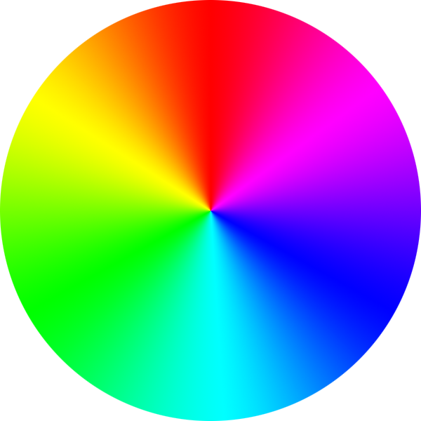
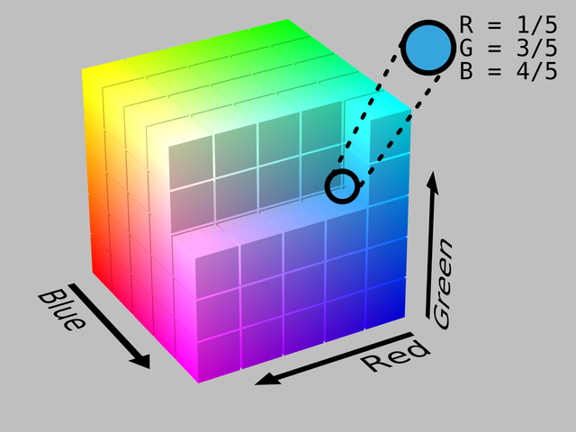
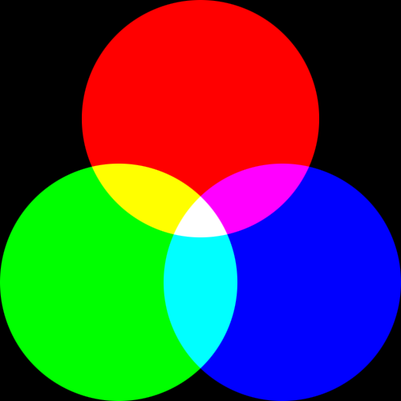
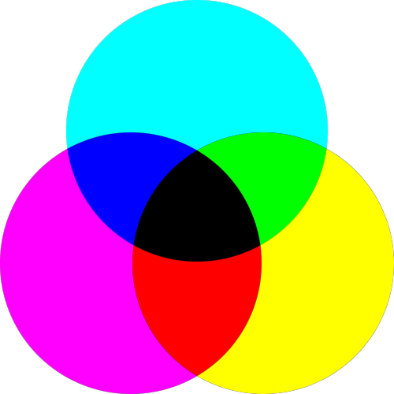
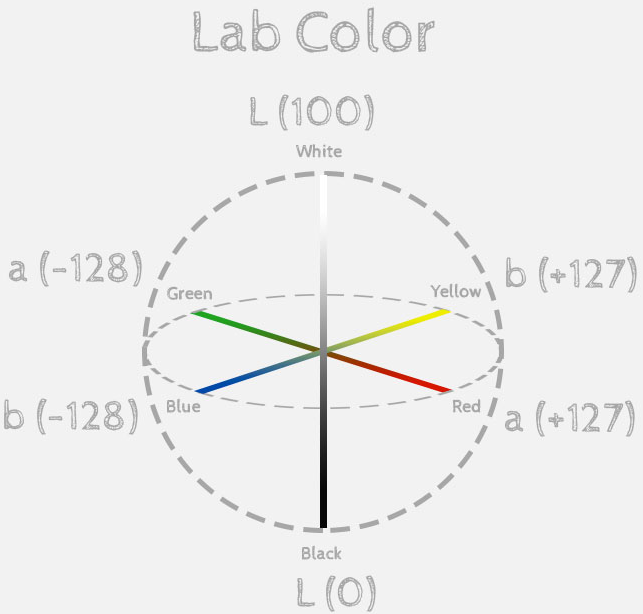

# Image Basic

- [Image Basic](#Image-Basic)
  - [Image type](#Image-type)
  - [Resolution](#Resolution)
  - [Color](#Color)

## Image type

- Raster: pixels image
  - *.bmp: not support alpha channel
  - *.jpg
  - *.gif
  - *.tiff
  - *.psd
  - *.png
- Vector: vector image
  - *.max: by 3ds Max
  - *.ai: by Illustrator
  - *.fla: by flash
  - *.wmf: by microsoft

Photoshop图层提供Convert to Smart Object, Rasterize Layer来进行位图与矢量图的转换
- Smart Object可以来回改变Image Size，对图片清晰程度影响较小  
- 普通图层可以使用Filter, Pencil, Brush...

## Resolution

- PPI: 针对**图片**而言, Pixels Per Inch，图片的属性
- DPI: 针对**设备**而言, Dots Per Inch, 一般电脑DPI=96, 一般打印机DPI=300,一般扫描DPI=600
- DPPX: Dots Per Pixel. 一般屏幕DPPX=1, Retina屏幕DPPX=2;

Photoshop/Menubar/Image/Image Size:
- Image Size: 5.93M
- Dimension(**图片数码尺寸**): 1920 Pixels, 1080 Pixels;图片在不同显示器上，Dimension不变
- FitTo: 预设的一些尺寸变换
- Width(**宽度**): 67.73 Centimeters
- Height(**高度**): 38.1 Centimeters
- Resolution: 72 Pixels/Inch
  > 1 Inch = 2.54 Centimeters, so 72/2.54*67.73=1920
- Resample: 变换尺寸的采用的插值算法
> 这张图如果在DPPX=1，DPI=72的屏幕上显示，那么Width=67.73cm, Height=38.1cm; DPI=96的屏幕上显示，那么Width=50.8cm, Height=28.58cm;

PhotoShop本质是对Pixels进行操作

Trick: View/Pixsel Aspect Ratio, 像素(最小单元)长宽比

## Color

HSL mode: 人眼描述颜色，色彩数量: 360x100x100
> 
- Hue: 色彩类型(色相). 360°颜色变化
- Saturation: 色彩是否艳丽(饱和度). 黑白灰饱和度都是0
- Lightness: 色彩明暗(亮度). 曝光不足(纯黑)→曝光过度(纯白)

Example: Image/Ajustments/Hue&Saturation(**Ctrl+U**)测试修改HSL的效果
> 

```bash
五色令人目盲；五音令人耳聋；五味令人口爽；驰骋畋猎，令人心发狂；难得之货，令人行妨；是以圣人为腹不为目，故去彼(目)取此(腹)。

道之出口，淡乎其无味。视之不足见。听之不足闻。用之不足既。

无数的形(色)，归纳出象(属性)，谓之抽象，由象辩形量化有度，无数的象，抽出大象，大象无形，包容万象近于道；
故恒无欲，以观其妙；# 无欲, 没有体系结构(HSL mode)的观察；直观的感受(感性思维)
恒有欲，以观其徼。# 有欲，有体系结构的观察; 客观感受(理性思维)
此两者，同出而异名
同谓之玄，玄之又玄，众妙之门
```

RGB mode: 黑背景打光(色彩数量255^3), 加色成像, 色域没有HSL范围大
> 
> 
- R: Red
- G: Green
- B: Blue

> Menubar/Image/Mode/
> - 8 bits/channel: R,G,B range: 0~2^8;  
> - 16 bits/channel: R,G,B range: 0~2^16;  
> - 32 bits/channel: R,G,B range: 0~2^32;  

CMYK mode: 白背景涂色，减色成像
> 
- C: Cyan
- M: Magenta
- Y: Yellow
- K: Black

```bash
一流公司做标准，二流公司做文化，三流公司做品牌，四流公司做产品
```

Lab mode: 最接近人类的视觉
> 
- L: Luminance
- a: Green→Red
- b: Blue→Yellow

Indexed Color: 1 Bytes显示颜色, 共显示2^8种颜色

Grayscale:
> Menubar/Image/Mode/
> -  8 bits/channel: gray range: 0~2^8;  
> - 16 bits/channel: gray range: 0~2^16;  
> - 32 bits/channel: gray range: 0~2^32;  

Bitmap: 在Grayscale基础上，变成只有黑白点