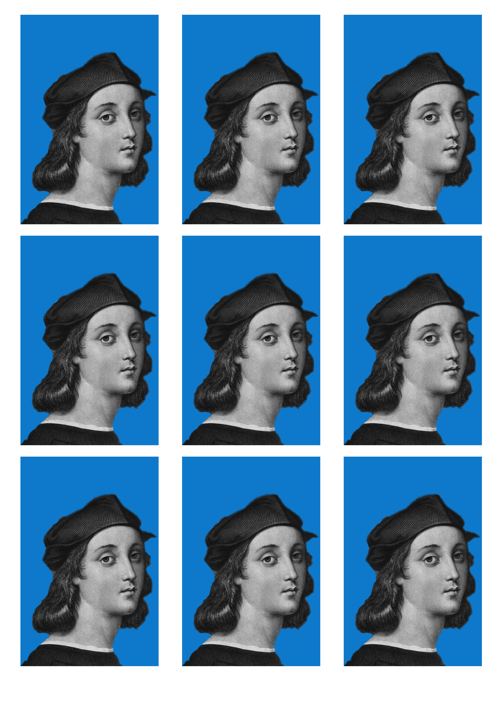
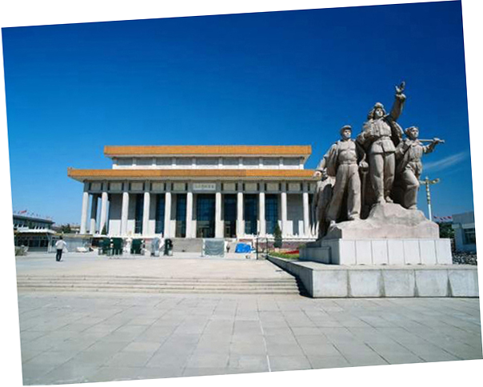

# Photoshop window

- [Photoshop window](#Photoshop-window)
  - [window](#window)
  - [view](#view)
  - [Transform](#Transform)
  - [Crop](#Crop)

## window

## view

some useful:
- `F`(view/screen mode): 在基本窗口、放大窗口、全屏之间切换;
- `space`: HandTool

Menubar/View
- `ctrl+0`: fit to screen
- `ctrl+1`: 100%
- `ctrl+2`: R,G,B all channels
- `ctrl+3`: R channel
- `ctrl+4`: G channel
- `ctrl+5`: B channel

Trick:
- ZoomTool与Navigator panel配合;
- RulerTool与info panel配合;

Example: 制作1寸照片
1. crop tool按照5:7裁剪
2. Image/ImageSize/调整DPI=300, width=2.5cm, height=3.5cm
3. 新建如下图片
   > 
4. 移动调整的头像到新建的空白图像，打印
   > 
5. 同理2寸照片
   > 

## Transform

Example: 倾斜图片调正method1
1. RulerTool
2. Image/ImageRotation/Arbitratry

Example: 倾斜图片调正method2
1. RulerTool, 展开的菜单选择StraightenLayer

Example: 倾斜图片调正method3(Best)
1. CropTool, 展开的菜单选择Straighten
2. 拉一条线
   > 

## Crop

- crop: crop选区可以旋转所以可以旋转裁切
- perspective crop: 近大远小

Example: 制作1寸照片
1. Image/ImageSize/DPI=300
2. CropTool菜单/Width=2.5cm, Height=3.5cm, DPI=300
3. Crop
4. 新建如下图片
   > 
5. 移动调整的头像到新建的空白图像，打印
   > 

Example: 两张图片拼接到一张图中
> 
> 
1. pic1的Image/CanvasSize增大
2. pic2移动到pic1, 设置pic2的图层透明度
3. 对准，然后恢复不透明度，就可以拼接
   > 